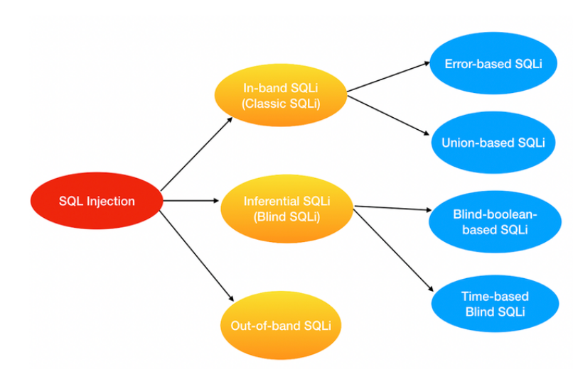

### Tìm hiểu các case SQL Injection, phân loại SQL injection, phân biệt theo dấu hiệu nhận biết, phương hướng khai thác và cách thức xử lý. Kèm theo demo mỗi loại

## Nguyên nhân:

+ Dữ liệu đầu vào từ người dùng hoặc từ các nguồn khác không được kiểm tra hoặc kiểm tra không kỹ lưỡng
+ Ứng dụng sử dụng các câu lệnh SQL động, trong đó dữ liệu được kết nối với mã SQL gốc để tạo câu lệnh SQL hoàn chỉnh
+ Sử dụng third party(thư viện) dính phải lỗ hổng này

## Case SQL Injection:

- Có rất nhiều lỗ hổng SQL injection, các cuộc tấn công và kỹ thuật phát sinh trong các tình huống khác nhau.
- Theo như em biết thì FLOW (Recon->Attack) của một cuộc tấn công sql injection cơ bản là đầu tiên kẻ tấn công sẽ xác định nơi có thể truyền các tham số từ browser và sever nhận lấy và truy vấn kết quả, sau đó thử truyền các kí tự như comments OR 1=1, UNION SELECT,.. xem có thông báo gì đặc biệt đối với sql injection thường hay không hoặc là vẫn trả ra kết quả như bình thường<Không bị lỗi> đối với BlindSql injection -> sau đó xác định loại database mà sever sử dụng -> xác định các thông tin như versions, các bảng các cột trong bảng, các thông tin quan trọng ví dụ như tìm version để xác định CVE mà nó dính phải -> Sau đó bắt tay vào khai thác để đạt được kết quả. Vì vậy cho nên em có thể tìm được các case như sau :

+ Subverting application logic, nơi mình có thể thay đổi truy vấn để can thiệp vào logic của ứng dụng.
+ Examining the database, nơi mình có thể trích xuất thông tin về phiên bản và cấu trúc của cơ sở dữ liệu.
+ Retrieving hidden data, nơi mình có thể sửa đổi truy vấn SQL để trả về kết quả bổ sung.
+ UNION attacks, nơi mình có thể truy xuất dữ liệu từ các bảng cơ sở dữ liệu khác nhau.
+ Blind SQL injection, trong đó kết quả của truy vấn mà mình kiểm soát không được trả về trong phản hồi của ứng dụng.

## Phân loại SQL injection

# In-band SQLi
- Đây là dạng tấn công phổ biến nhất và cũng dễ để khai thác lỗ hổng SQL Injection nhất
- Xảy ra khi hacker có thể tổ chức tấn công và thu thập kết quả trực tiếp trên cùng một kênh liên lạc
- In-Band SQLi chia làm 2 loại chính:
+ Error-based SQLi
+ Union-based SQLi

- Error-based SQLi:
+ Là một kỹ thuật tấn công SQL Injection dựa vào thông báo lỗi được trả về từ Database Server có chứa thông tin về cấu trúc của cơ sở dữ liệu.
+ Trong một vài trường hợp, chỉ một mình Error-based là đủ cho hacker có thể liệt kê được các thuộc tính của cơ sở dữ liệu

Demo : 

- Union-based SQLi:
+ Là một kỹ thuật tấn công SQL Injection dựa vào sức mạnh của toán tử UNION trong ngôn ngữ SQL cho phép tổng hợp kết quả của 2 hay nhiều câu truy vấn SELECTION trong cùng 1 kết quả và được trả về như một phần của HTTP response

Demo :

# Inferential SQLi (Blind SQLi)
- Không giống như In-band SQLi, Inferential SQL Injection tốn nhiều thời gian hơn cho việc tấn công do không có bất kì dữ liệu nào được thực sự trả về thông qua web application và hacker thì không thể theo dõi kết quả trực tiếp như kiểu tấn công In-band
- Thay vào đó, kẻ tấn công sẽ cố gắng xây dựng lại cấu trúc cơ sở dữ liệu bằng việc gửi đi các payloads, dựa vào kết quả phản hồi của web application và kết quả hành vi của database server.
- Có 2 dạng tấn công chính
+ Blind-boolean-based
+ Blind-time-based SQLi

- Blind-boolean-based:
+ Là kĩ thuật tấn công SQL Injection dựa vào việc gửi các truy vấn tới cơ sở dữ liệu bắt buộc ứng dụng trả về các kết quả khác nhau phụ thuộc vào câu truy vấn là True hay False.
+ Tuỳ thuộc kết quả trả về của câu truy vấn mà HTTP reponse có thể thay đổi, hoặc giữ nguyên
+ Kiểu tấn công này thường chậm (đặc biệt với cơ sở dữ liệu có kích thước lớn) do người tấn công cần phải liệt kê từng dữ liệu, hoặc mò từng kí tự

Demo:

- Time-based Blind SQLi:
+ Time-base Blind SQLi là kĩ thuật tấn công dựa vào việc gửi những câu truy vấn tới cơ sở dữ liệu và buộc cơ sở dữ liệu phải chờ một khoảng thời gian (thường tính bằng giây) trước khi phản hồi.
+ Thời gian phản hồi (ngay lập tức hay trễ theo khoảng thời gian được set) cho phép kẻ tấn công suy đoán kết quả truy vấn là TRUE hay FALSE
+ Kiểu tấn công này cũng tốn nhiều thời gian tương tự như Boolean-based SQLi

Demo:

# Out-of-band SQLi
- Out-of-band SQLi không phải dạng tấn công phổ biến, chủ yếu bởi vì nó phụ thuộc vào các tính năng được bật trên Database Server được sở dụng bởi Web Application.
- Kiểu tấn công này xảy ra khi hacker không thể trực tiếp tấn công và thu thập kết quả trực tiếp trên cùng một kênh (In-band SQLi), và đặc biệt là việc phản hồi từ server là không ổn định
- Kiểu tấn công này phụ thuộc vào khả năng server thực hiện các request DNS hoặc HTTP để chuyển dữ liệu cho kẻ tấn công.
- Ví dụ như câu lệnh xp_dirtree trên Microsoft SQL Server có thể sử dụng để thực hiện DNS request tới một server khác do kẻ tấn công kiểm soát, hoặc Oracle Database’s UTL HTTP Package có thể sử dụng để gửi HTTP request từ SQL và PL/SQL tới server do kẻ tấn công làm chủ

Demo :
