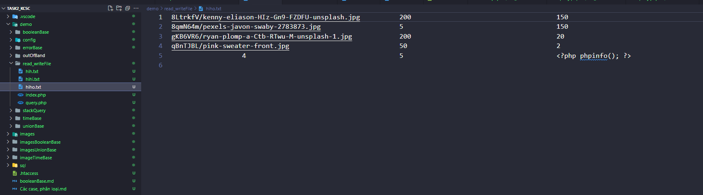

# Link demo : https://github.com/l3mnt2010/task2_KCSC/tree/main/demo/read_writeFile
# Cách khắc phục :
Có thể khắc phục bằng cách tham số hóa đầu vào của thâm số người dùng truyền vào bằng một số cách như là:
-  $stmt = $conn->prepare("SELECT * FROM users WHERE username = ? AND password = ?");
  $stmt->bind_param("ss", $username, $password);
  $stmt->execute();
- Hoặc làm sạch đầu vào   $cleaned_username = mysqli_real_escape_string($conn, $username);
$cleaned_password = mysqli_real_escape_string($conn, $password);
- Và tìm hiểu các CVE của các phiên bản để tránh được lỗi này có thể xảy ra.

### READFILE BY SQL INJECTION
Vào giao diện em thấy như này

Đoạn xử lí logic
      <?php
require_once "../config/connectdb.php";

if (isset($_GET['name'])) {
    global $conn;
    $name = $_GET['name'];
    $sql = "SELECT * FROM $name";
    $product_query = mysqli_query($conn, $sql);

    if ($product_query) {
        while ($row = mysqli_fetch_assoc($product_query)) {
            echo '
                

                    

                        

                            
                            

                                <!-- Wishlist and Cart buttons here -->
                            

                        

                        <a href="#">
                            <h2 class="mb-2 text-xl font-bold text-black dark:text-white">
                                ' . $row['name'] . '
                            </h2>
                        </a>
                        

                            $' . $row['sale'] . '.00
                            $' . $row['price'] . '.00
                        

                        

               <svg xmlns="http://www.w3.org/2000/svg" width="16" height="16" fill="currentColor"
                   class="bi bi-star-fill" viewBox="0 0 16 16">
                   <path
                       d="M3.612 15.443c-.386.198-.824-.149-.746-.592l.83-4.73L.173 6.765c-.329-.314-.158-.888.283-.95l4.898-.696L7.538.792c.197-.39.73-.39.927 0l2.184 4.327 4.898.696c.441.062.612.636.282.95l-3.522 3.356.83 4.73c.078.443-.36.79-.746.592L8 13.187l-4.389 2.256z" />
               </svg>
               <svg xmlns="http://www.w3.org/2000/svg" width="16" height="16" fill="currentColor"
                   class="bi bi-star-fill" viewBox="0 0 16 16">
                   <path
                       d="M3.612 15.443c-.386.198-.824-.149-.746-.592l.83-4.73L.173 6.765c-.329-.314-.158-.888.283-.95l4.898-.696L7.538.792c.197-.39.73-.39.927 0l2.184 4.327 4.898.696c.441.062.612.636.282.95l-3.522 3.356.83 4.73c.078.443-.36.79-.746.592L8 13.187l-4.389 2.256z" />
               </svg>
               <svg xmlns="http://www.w3.org/2000/svg" width="16" height="16" fill="currentColor"
                   class="bi bi-star-fill" viewBox="0 0 16 16">
                   <path
                       d="M3.612 15.443c-.386.198-.824-.149-.746-.592l.83-4.73L.173 6.765c-.329-.314-.158-.888.283-.95l4.898-.696L7.538.792c.197-.39.73-.39.927 0l2.184 4.327 4.898.696c.441.062.612.636.282.95l-3.522 3.356.83 4.73c.078.443-.36.79-.746.592L8 13.187l-4.389 2.256z" />
               </svg>
               <svg xmlns="http://www.w3.org/2000/svg" width="16" height="16" fill="currentColor"
                   class="bi bi-star-fill" viewBox="0 0 16 16">
                   <path
                       d="M3.612 15.443c-.386.198-.824-.149-.746-.592l.83-4.73L.173 6.765c-.329-.314-.158-.888.283-.95l4.898-.696L7.538.792c.197-.39.73-.39.927 0l2.184 4.327 4.898.696c.441.062.612.636.282.95l-3.522 3.356.83 4.73c.078.443-.36.79-.746.592L8 13.187l-4.389 2.256z" />
               </svg>
               <svg xmlns="http://www.w3.org/2000/svg" width="16" height="16" fill="currentColor"
                   class="bi bi-star" viewBox="0 0 16 16">
                   <path
                       d="M2.866 14.85c-.078.444.36.791.746.593l4.39-2.256 4.389 2.256c.386.198.824-.149.746-.592l-.83-4.73 3.522-3.356c.33-.314.16-.888-.282-.95l-4.898-.696L8.465.792a.513.513 0 0 0-.927 0L5.354 5.12l-4.898.696c-.441.062-.612.636-.283.95l3.523 3.356-.83 4.73zm4.905-2.767-3.686 1.894.694-3.957a.565.565 0 0 0-.163-.505L1.71 6.745l4.052-.576a.525.525 0 0 0 .393-.288L8 2.223l1.847 3.658a.525.525 0 0 0 .393.288l4.052.575-2.906 2.77a.565.565 0 0 0-.163.506l.694 3.957-3.686-1.894a.503.503 0 0 0-.461 0z" />
               </svg>
           

                    

                    
                

            ';
        }
    } else {
        echo '
Invalid name or your hack me!!!
';
    }
}
?>

+ trang web sẽ lấy lên của page và lọc theo product
- Hướng của em là sẽ đọc được file flag trong này
- Đầu tiên em sẽ thử thêm dấu comment vào

- Và em vẫn nhận được kết quả bình thường nên đây sẽ là chỗ em khai thác

em có tìm được đoạn này

- Em sẽ sử dụng UNION SELECT để injection
- Việc đầu tiên là em xác định số cột trả về của truy vấn
- 
Em nhận được kết quả đúng và thêm 1 sản phẩm full NULL

+ Vậy là em đã xác định được có 6 cột trả ra từ truy vấn từ bảng products
Hmm, bởi vì file php nó nhận <?php ?> nên em làm mãi không được:v
+Nên em sử dụng hàm LOAD_FILE để đọc dữ liệu của một file theo như em có tra thì hàm này chỉ đọc file với đường dẫn tuyệt đối nên window hơi dị hơn linux chỗ này nên em xin mạo phép dùng đường dẫn tuyệt đối:<
    UNION SELECT NULL,LOAD_FILE('C:/laragon/www/task2_KCSC/demo/read_writeFile/hihi.txt'),NULL,NULL,NULL,NULL--
còn nếu linux thì thay thành etc/passwd
- Em đọc được file hihi.txt

- Và hoàn toàn giống với file hihi.txt của em

Như vậy là em đã đọc được file bằng query trong mysql

# WRITE FILE BY SQL INJECTION

- Bài này để tiện hơn thì đầu tiên em sẽ test với việc cho file txt chạy như file php

-- Em vào giao diện

HEhe em đã test thành công em mới viết giải
- Đầu tiên như đã xác định ở trên thì truy vấn sẽ trả ra 6 cột từ bảng

đây là payload em dùng nhưng mà mình phải lưu ý là nó sẽ không ghi đè file nên để tên gì cũng được ạ
Payload : UNION SELECT 1,2,3,4,5,0x3c3f70687020706870696e666f28293b203f3e into outfile 'C:/laragon/www/task2_KCSC/demo/read_writeFile/hiho.txt'--

Em nhận được kết quả thành công và bây giờ mình vào file hoho.txt

- Vì em cấu hình .htaccess nên chạy được và trong file hiho.txt

- Bây giờ em thử viết vào 11 file php em sẽ chuyển tên thành hiha.php

Em nhận được kết quả y hệt luôn

và đuôi của nó là php nên là em có thể không cần file .htaccess để RCE được

Vậy là em có thể RCE được với chức năng write-file này
@@ Thật là tuyệt vời anh ạ:v 
